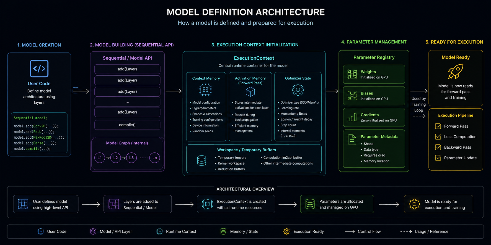
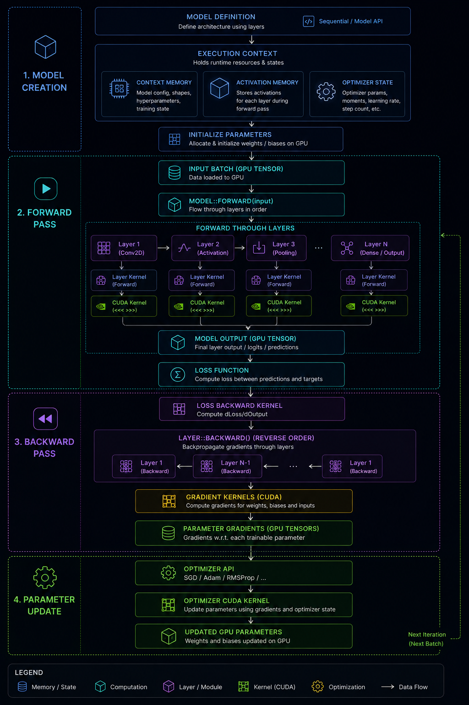
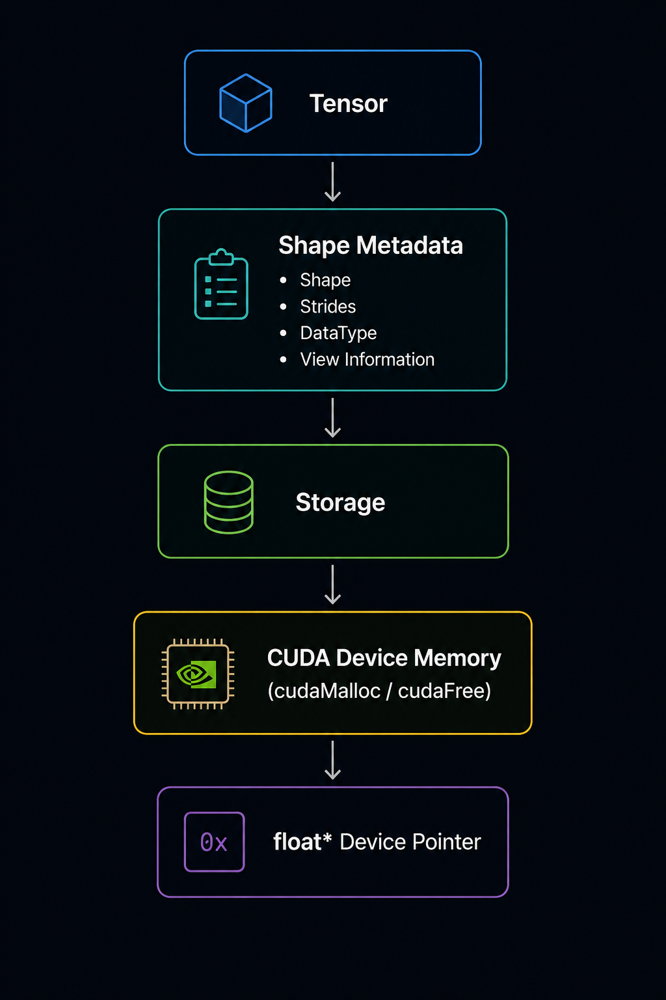
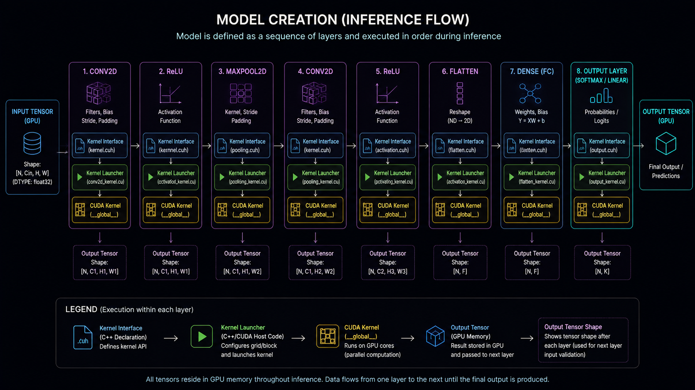
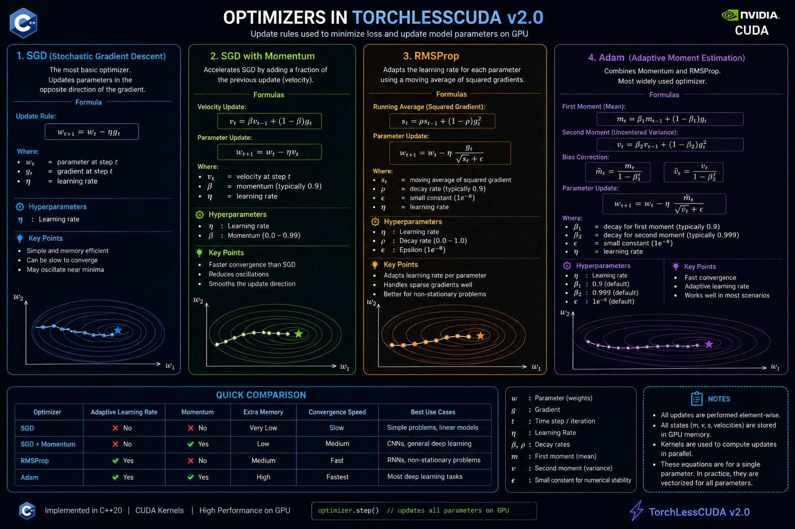

## TorchLessCUDA

#### TorchLessCUDA is a deep learning framework built entirely from scratch using Modern C++20 and CUDA, implementing tensor operations, GPU training, and inference without relying on existing machine learning frameworks.

#

### ◈ Overview

Modern deep learning frameworks abstract away GPU programming, memory management, tensor operations, automatic differentiation, and optimization.

TorchLessCUDA focuses on implementing these components manually while maintaining a modular, extensible, and production-inspired architecture.

The framework supports end-to-end neural network training and inference entirely on the GPU through custom CUDA kernels, providing a deeper understanding of how modern deep learning systems operate internally.

#

### ◈ Architecture

    

#

### ◈ Model Execution Flow

    

#

### ◈ Tensor Engine

    

#

### ◈ Inference Pipeline

    

#

### ◈ Optimizers

    

#

### ◈ Features

#### Core Engine

- GPU-resident Tensor abstraction
- CUDA-first execution engine
- Automatic forward propagation
- Automatic backpropagation
- Modular neural network architecture
- Training and inference execution contexts
- Efficient GPU memory management
- Workspace reuse
- Activation & gradient caching

#

#### Implemented Layers

- Dense (Fully Connected)
- Conv2D
- Max Pooling
- Flatten
- Activation Layer

#

#### Activation Functions

- ReLU
- Sigmoid
- Tanh
- Softmax

#

#### Loss Functions

- Cross Entropy Loss (CCE)

#

#### Optimizers

- SGD
- Momentum SGD
- AdaGrad
- RMSProp
- Adam

#

#### Dataset Support

- MNIST
- IDX Image Loader
- IDX Label Loader
- Mini-batch Data Loading

#

#### Development Infrastructure

- Modern C++20
- CUDA 12.x
- CMake
- GitHub Actions
- Visual Studio 2022
- Cross-platform project structure

#

### ◈ ⚙️ Requirements

#### Hardware

- NVIDIA GPU with CUDA support

#### Software

- C++20 compatible compiler
- NVIDIA CUDA Toolkit 12.x
- CMake 3.25+
- Visual Studio 2022 (Windows)

#

### ◈ Current Status

Implemented:

- Tensor engine
- CUDA backend
- GPU memory manager
- Forward propagation
- Backpropagation
- Training pipeline
- Inference pipeline
- Execution context compilation
- Neural network layers
- Optimizers
- MNIST training pipeline

#

### ◈ Current Limitations

- Only Cross Entropy Loss (CCE) is implemented.
- Only MNIST has been tested.
- GPU execution only (no CPU backend).
- No model serialization.
- No Batch Normalization.
- No Dropout.
- No learning-rate schedulers.
- No mixed precision (FP16/BF16).
- Single GPU only.
- No distributed training.

#

### ◈ Future Work

- Additional neural network layers
- Additional loss functions
- Batch Normalization
- Dropout
- Learning-rate schedulers
- Mixed precision training
- Model serialization
- Additional datasets
- Multi-GPU training
- Performance profiling & optimization

#

### ◈ Motivation

TorchLessCUDA was built as a systems-oriented learning project to understand how deep learning frameworks work beneath high-level APIs.

Instead of relying on existing ML libraries, the framework implements its own tensor engine, execution pipeline, CUDA kernels, neural network layers, optimization algorithms, and GPU memory management using Modern C++20 and CUDA.

The primary goal is to bridge the gap between deep learning theory and low-level systems implementation while providing a modular foundation for future experimentation and extension.

#

### ◈ License

This project is released under the MIT License.
